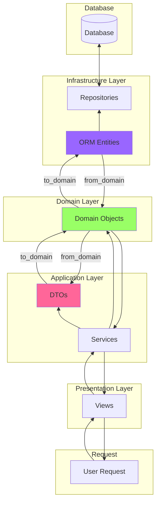

# django-templates

- Layered Architecture를 기반으로 한 Domain 중심의 개발을 목표로 합니다. 
- 각 레이어의 역할과 책임을 명확히 하여 유지보수성과 확장성을 높였습니다.

## 아키텍처 개요

Layered Architecture는 다음의 네 가지 레이어로 구성됩니다:

1. **Presentation Layer**
2. **Application Layer**
3. **Domain Layer**
4. **Infrastructure Layer**

각 레이어별로 Django 기준 사용된 파일은 다음과 같습니다:

| 레이어                  | 파일                        | 요약                                                |
|----------------------|---------------------------|---------------------------------------------------|
| Presentation Layer   | `views.py`, `templates/`  | 사용자의 요청을 받아 Application Layer로 전달하고, 응답을 반환합니다. |
| Application Layer    | `services.py`, `dto.py`   | Presentation Layer와 Domain Layer 간의 중개 역할을 하며, 비즈니스 로직을 실행합니다. |
| Domain Layer         | `domain.py`               | 애플리케이션의 핵심 비즈니스 로직과 규칙을 포함하며, `도메인 객체를 관리`합니다. |
| Infrastructure Layer | `models.py`, `repository.py` | 데이터베이스와 같은 외부 시스템과의 상호작용을 관리합니다.            |

🔑 **도메인 주도 개발 (DDD)**: 모든 것은 Domain Layer를 기준으로 개발되도록 하는 것을 목표로 합니다.

### 1. Presentation Layer

**역할**: 사용자의 요청을 받아 Application Layer로 전달하고, 응답을 반환합니다. 주로 웹 페이지 렌더링 또는 API 엔드포인트를 제공합니다.

**주요 컴포넌트**:
- Views (`views.py`)
- Templates (`templates/`)
- Controllers

**예시**:
```python
# views.py
from rest_framework.decorators import api_view
from drf_yasg.utils import swagger_auto_schema
from .dto import ExampleDomainDTO
from . import services

@swagger_auto_schema(
    method='post',
    request_body=ExampleDomainDTO.schema(),
    responses={201: ExampleDomainDTO.schema()},
    operation_description="Create a new example domain object"
)
@api_view(['GET', 'POST'])
def example_view(request):
    if request.method == 'GET':
        return services.example_view_get(request)
    elif request.method == 'POST':
        return services.example_view_post(request)
    else:
        raise Exception("Not supported method")
```

### 2. Application Layer

**역할**: Presentation Layer와 Domain Layer 간의 중개 역할을 하며, 비즈니스 로직을 실행하기 위해 Domain Layer를 호출합니다.

**주요 컴포넌트**:
- Services (`services.py`)
- DTOs (`dto.py`)

**메서드**:
- **to_domain**: DTO에서 도메인 객체로 변환
- **from_domain**: 도메인 객체에서 DTO로 변환

**예시**:
```python
# services.py
from rest_framework.response import Response
from django.shortcuts import render
from .dto import ExampleDomainDTO
from .repository import ExampleDomainRepository
from .domain import ExampleDomain

def example_view_get(request):
    return render(request, 'app1/register.html')

def example_view_post(request):
    data = ExampleDomainDTO(**request.data)
    created_example = create_example_service(data.to_domain())
    return Response(ExampleDomainDTO.from_domain(created_example).dict(), status=201)

def create_example_service(data: ExampleDomain) -> ExampleDomain:
    repository = ExampleDomainRepository()
    created_example = repository.create(data)
    return created_example
```

```python
# dto.py
from pydantic import BaseModel, Field
from typing import Optional
from datetime import datetime
from ..domain import ExampleDomain

class ExampleDomainDTO(BaseModel):
    id: Optional[int] = Field(default=None, description="ID")
    name: str = Field(description="Name")
    description: Optional[str] = Field(default=None, description="Description")
    created_at: datetime = Field(description="Creation Date")

    def to_domain(self):
        return ExampleDomain.new(
            id=self.id,
            name=self.name,
            description=self.description,
            created_at=self.created_at
        )

    @staticmethod
    def from_domain(domain: ExampleDomain):
        return ExampleDomainDTO(
            id=domain.id,
            name=domain.name,
            description=domain.description,
            created_at=domain.created_at
        )
```

### 3. Domain Layer

**역할**: 애플리케이션의 핵심 비즈니스 로직을 포함합니다. 도메인 객체와 비즈니스 규칙을 관리합니다.

**주요 컴포넌트**:
- Domain Objects (`domain.py`)

**예시**:
```python
# domain.py
from dataclasses import dataclass
from typing import Optional
from datetime import datetime

@dataclass
class ExampleDomain:
    id: Optional[int]
    name: str
    description: Optional[str]
    created_at: datetime

    @staticmethod
    def new(id: Optional[int], name: str, description: Optional[str], created_at: datetime):
        return ExampleDomain(id, name, description, created_at)
```

### 4. Infrastructure Layer

**역할**: 데이터베이스와 같은 외부 시스템과의 상호작용을 관리합니다.

**주요 컴포넌트**:
- Repositories (`repository.py`)
- ORM Entities (`models.py`)

**메서드**:
- **to_domain**: ORM 엔티티에서 도메인 객체로 변환
- **from_domain**: 도메인 객체에서 ORM 엔티티로 변환

**예시**:
```python
# models.py
from django.db import models

class ExampleDomainModel(models.Model):
    name = models.CharField(max_length=255)
    description = models.TextField(null=True, blank=True)
    created_at = models.DateTimeField(auto_now_add=True)

    def to_domain(self):
        from ..domain import ExampleDomain
        return ExampleDomain(
            id=self.id,
            name=self.name,
            description=self.description,
            created_at=self.created_at
        )

    @staticmethod
    def from_domain(domain):
        return ExampleDomainModel(
            id=domain.id,
            name=domain.name,
            description=domain.description,
            created_at=domain.created_at
        )
```

```python
# repository.py
from typing import List, Optional
from django.db import transaction
from .models import ExampleDomainModel
from ..domain import ExampleDomain
from django.core.exceptions import ObjectDoesNotExist

class ExampleDomainRepository:

    @staticmethod
    @transaction.atomic
    def create(domain: ExampleDomain) -> ExampleDomain:
        entity = ExampleDomainModel.from_domain(domain)
        entity.save()
        return entity.to_domain()

    @staticmethod
    @transaction.atomic
    def update(domain: ExampleDomain) -> ExampleDomain:
        try:
            entity = ExampleDomainModel.objects.get(id=domain.id)
            entity.name = domain.name
            entity.description = domain.description
            entity.created_at = domain.created_at
            entity.save()
            return entity.to_domain()
        except ObjectDoesNotExist:
            raise NotFoundException(f"ExampleDomain with id {domain.id} not found")

    @staticmethod
    @transaction.atomic
    def delete(domain_id: int) -> None:
        try:
            entity = ExampleDomainModel.objects.get(id=domain_id)
            entity.delete()
        except ObjectDoesNotExist:
            raise NotFoundException(f"ExampleDomain with id {domain_id} not found")

    @staticmethod
    def get_by_id(domain_id: int) -> Optional[ExampleDomain]:
        try:
            entity = ExampleDomainModel.objects.get(id=domain_id)
            return entity.to_domain()
        except ObjectDoesNotExist:
            raise NotFoundException(f"ExampleDomain with id {domain_id} not found")

    @staticmethod
    def find_all() -> List<ExampleDomain]:
        entities = ExampleDomainModel.objects.all()
        return [entity.to_domain() for entity in entities]

    @staticmethod
    def find_by(**kwargs) -> List<ExampleDomain]:
        entities = ExampleDomainModel.objects.filter(**kwargs)
        return [entity.to_domain() for entity in entities]
```

### 전체 구조 - User Request Flow



이 구조를 통해 각 레이어의 역할을 명확히 하고, 변화에 강한 시스템을 설계할 수 있습니다. 각 레이어는 다른 레이어의 세부 사항을 모른 채 자신의 역할을 수행할 수 있습니다.
